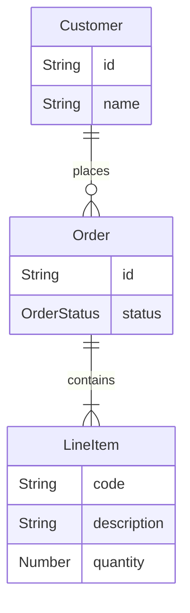
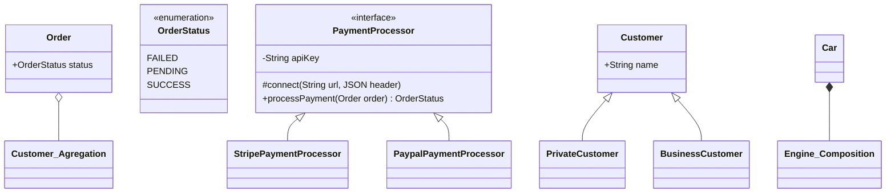
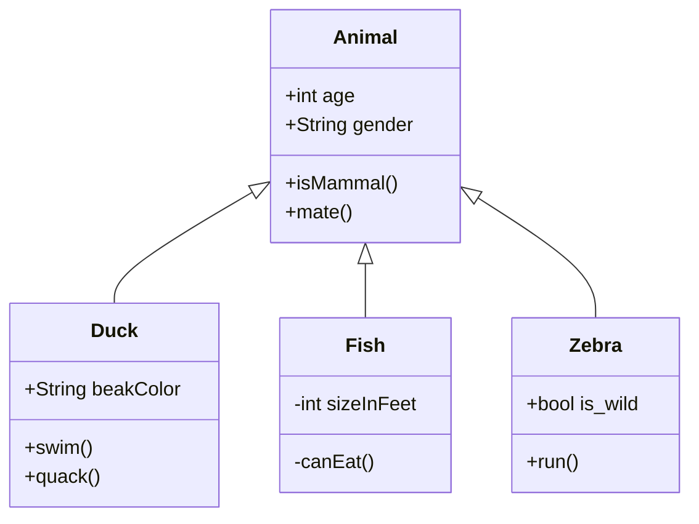
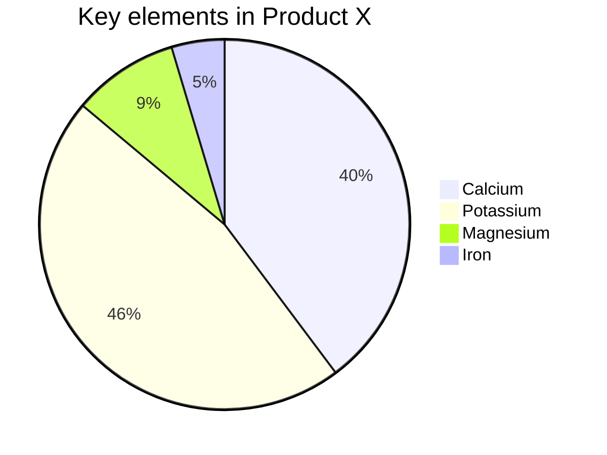
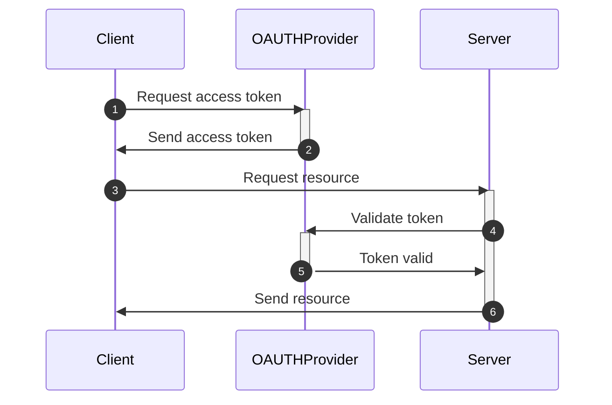
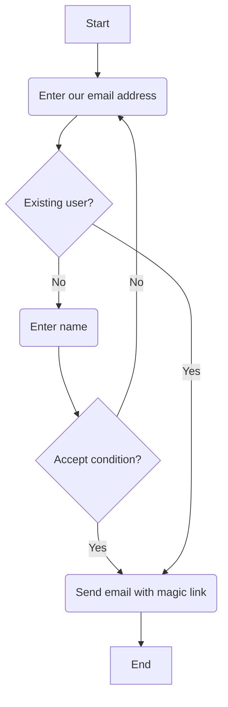

# Mermaid Markdown Practice

### Order Process - Entity Relationship

### Payment Process - Class Diagram

### Animal Class - Class Diagram

### Pie Chart

### OAUTH Process - Sequence Diagram

### Login Process - Flowchart
